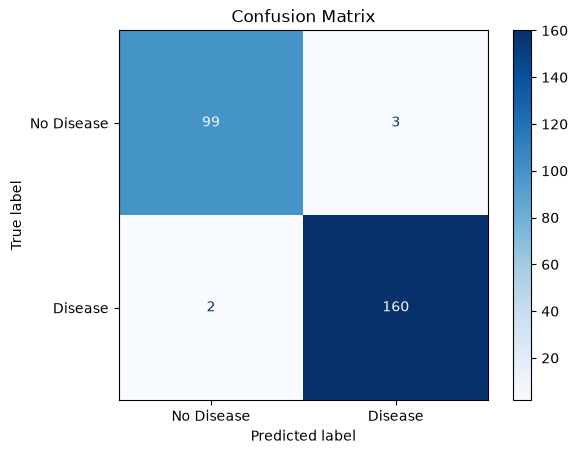
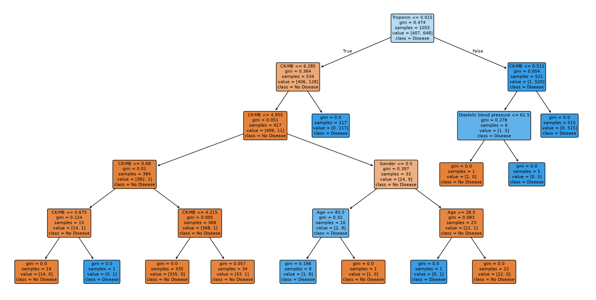

<p align="center">
  
  
  
  
  
</p>

<h1 align="center">❤️ Heart Disease Prediction — Decision Tree</h1>

<p align="center">
A Decision Tree Classifier that predicts whether a patient has heart disease based on clinical measurements, and outputs a probability score for new patients.
</p>

---

## 📑 Table of Contents

- [Problem Statement](#-problem-statement)
- [Dataset](#-dataset)
- [Workflow](#️-workflow)
- [Results](#-results)
- [Feature Importance](#-feature-importance)
- [Decision Tree Visualization](#-decision-tree-visualization)
- [Project Structure](#-project-structure)
- [How to Run](#-how-to-run)
- [Tech Stack](#️-tech-stack)
- [Future Improvements](#-future-improvements)
- [Author](#-author)

---

## 🎯 Problem Statement

Early detection of heart disease can save lives, but manual risk assessment from raw clinical data is time-consuming. This project trains a Decision Tree Classifier on real patient measurements to predict heart disease risk, and shows which clinical factors matter most — useful both as a screening aid and as an interpretable model doctors can reason about (unlike a black-box neural network).

---

## 📂 Dataset

- **1,319 patient records**
- **Features:** Age, Gender, Heart Rate, Systolic Blood Pressure, Diastolic Blood Pressure, Blood Sugar, CK-MB, Troponin
- **Target:** Result — positive / negative for heart disease

---

## ⚙️ Workflow

1. **Data Cleaning** — dropped duplicates, filled missing numeric values with median, categorical with mode
2. **Encoding** — one-hot encoded categorical columns
3. **Train/Test Split** — 80/20 split, stratified by target class
4. **Model Training** — `DecisionTreeClassifier` (criterion='gini', max_depth=5, tuned to avoid overfitting)
5. **Evaluation** — accuracy, classification report, confusion matrix
6. **Interpretability** — feature importance ranking + full tree visualization
7. **Inference** — predicts on new, unseen patient data

---

## 📊 Results

| Metric | Value |
|---|---|
| **Accuracy** | **98.11%** |
| Precision (Disease) | 0.98 |
| Recall (Disease) | 0.99 |
| F1-score (Disease) | 0.98 |
| Test set size | 264 patients |

### 🔢 Confusion Matrix

<p align="center">
  
</p>

---

## 🔍 Feature Importance

Troponin and CK-MB — both real cardiac biomarkers used clinically to diagnose heart attacks — turned out to be by far the most predictive features, which lines up with real-world medical knowledge:

<p align="center">
  
</p>

---

## 🌳 Decision Tree Visualization

<p align="center">
  
</p>

---

## 📁 Project Structure

```
heart-disease-decision-tree/
│
├── heart-disease-decision-tree.ipynb   # Full data cleaning, training & evaluation pipeline
├── confusion_matrix.png                # Model evaluation
├── decision_tree.png                   # Full trained tree
├── feature_importance.png              # Which features drive predictions
└── README.md                           # Project documentation
```

---

## ▶️ How to Run

1. Clone this repository:
   ```bash
   git clone https://github.com/mawais37/heart-disease-decision-tree.git
   cd heart-disease-decision-tree
   ```
2. Install dependencies:
   ```bash
   pip install pandas numpy matplotlib seaborn scikit-learn
   ```
3. Add your dataset as `heart.csv` in the same folder, then run the notebook:
   ```bash
   jupyter notebook heart-disease-decision-tree.ipynb
   ```

---

## 🛠️ Tech Stack

- **Language:** Python
- **Data Handling:** Pandas, NumPy
- **Modeling:** scikit-learn (Decision Tree Classifier)
- **Visualization:** Matplotlib, Seaborn

---

## 🚀 Future Improvements

- [ ] Compare against Random Forest / Gradient Boosting for a stronger baseline
- [ ] Add cross-validation instead of a single train/test split
- [ ] Tune `max_depth` and `criterion` systematically with GridSearchCV
- [ ] Build a simple web form for live patient risk prediction

---

## 👤 Author

**Muhammad Awais**
Python Developer | Data Analyst | AI/ML Enthusiast
🔗 [GitHub](https://github.com/mawais37)
